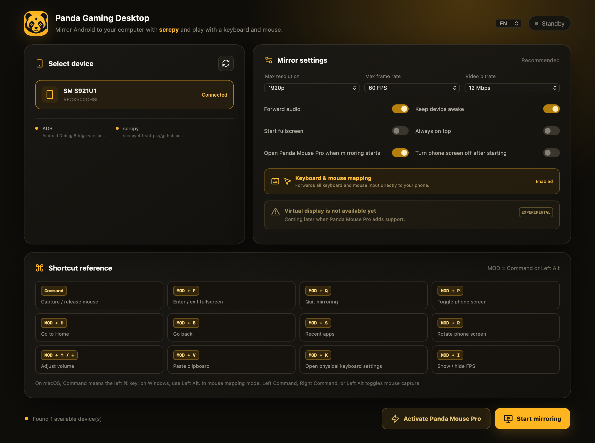

# Panda Gaming Desktop

A desktop companion built for Panda Mouse Pro, bringing Android games to your
computer with keyboard and mouse controls. Powered by the open-source project
[scrcpy](https://github.com/Genymobile/scrcpy).



## Features

- Windows, macOS, and Linux support
- USB and wireless ADB device detection
- One-click Android screen mirroring
- Keyboard and mouse forwarding for Panda Mouse Pro
- One-click Panda Mouse Pro launch and activation
- Controls for resolution, frame rate, bitrate, audio, fullscreen, and more
- Built-in scrcpy shortcut reference
- Chinese and English interface
- Bundled adb, scrcpy, and scrcpy-server in release packages

Panda Gaming Desktop uses the device's main display by default. Virtual display
support is reserved for a future experimental release.

## Development

Install Node.js and Rust, then run:

```bash
npm install
npm run tauri dev
```

Development mode can use adb and scrcpy from your system `PATH`. On macOS and
Windows, common Android SDK and package-manager locations are also detected.

To run only the web interface:

```bash
npm run dev
```

## Build an Installer

Build an installer for the current operating system:

```bash
npm run package
```

The packaging script downloads the official scrcpy 4.1 portable package for
the current platform, verifies its SHA-256 checksum, bundles the required tools,
and runs `tauri build`.

Build output is written to:

```text
src-tauri/target/release/bundle/
```

Supported release targets:

- Windows x64: NSIS installer
- Linux x64: AppImage and Debian package
- macOS Apple Silicon: DMG
- macOS Intel: DMG

## GitHub Releases

Push a version tag such as `v0.1.0`, or manually run the **Build desktop
release** workflow. GitHub Actions builds all supported platforms and uploads
the installers to a draft GitHub Release.

Unsigned macOS and Windows builds may display operating-system security
warnings. Code signing and macOS notarization are recommended for public
releases.

## Privacy and Code Signing

Panda Gaming Desktop does not collect analytics or transmit personal data.
See the [privacy policy](PRIVACY.md) for details.

Release signing rules, trusted build sources, and maintainer roles are defined
in the [code signing policy](CODE_SIGNING_POLICY.md).

## Third-Party Software

Release packages include the license file supplied by scrcpy and the project's
[third-party notices](src-tauri/resources/THIRD_PARTY_NOTICES.txt). The exact
scrcpy package version, source URL, and SHA-256 checksum used by each build are
recorded in `tools/panda-tools.json` inside the installed application.

## License

Source code and project artwork are licensed under the
[Apache License 2.0](LICENSE). This license does not grant permission to use
Panda Gaming trademarks or imply endorsement of modified distributions.
